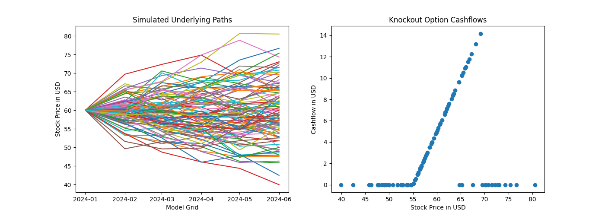

# Monte Carlo Contracts

[](https://pypi.python.org/pypi/monte-carlo-contracts)
[](https://github.com/luphord/monte-carlo-contracts/actions)

A Python library to **compose complex fincancial products from elementary contracts**.

This is what it looks like (see [Minimal.ipynb](examples/Minimal.ipynb) for the full example):

```python
ko_option = Until(
    Stock("ABC Eqty") > 70,
    When(
        At(np.datetime64("2024-06-01")),
        Or(Stock("ABC Eqty") * One("USD") - 55 * One("USD"), Zero()),
    ),
)

evaluate(model, ko_option)
# 3.2316051920219797
```



This library employs ideas from [How to Write a Financial Contract](https://citeseerx.ist.psu.edu/viewdoc/summary?doi=10.1.1.14.7885) by S. L. Peyton Jones and J-M. Eber.
However, the implementation is not based on functional programming but rather using an object oriented approach.
Also, this implementation is tailored towards Monte Carlo based cashflow generation whereas the paper favours more general methods.

For an introduction to the concepts of composable contracts and usage instructions of this library, see the [Introduction](examples/Introduction.ipynb) notebook.

## Features
* Composition of financial contracts using elementary contracts `Zero`, `One`, `Give`, `Scale`, `And`, `When`, `Cond`, `Anytime`, `Until`, `Delay` and `Exchange`.
* Boolean and real valued observables (stochastic processes) to be referenced by contracts.
* Cashflow generation for composed contracts given simulation models on fixed dategrids.

## Non-Features
* Financial products description language. This library provides classes to describe financial contracts at a low level; a high level description language could be translated into this low level language, but not the other way round.
* Lifecycle management. Capturing past lifecycle events of financial products such as call rights, knockouts or even fixings is left to a high level description. Doing it here would be very hard due to the nature of the acquisition date *free* variable and the lack of mandatory start / end dates in particular. Just think about a simple contract such as `When(Stock("ABC") > 100, One("EUR"))`. Which fixings would you require? Up to which point would you perform model simulation?
* Pricing methods other than Monte Carlo Simulation. While composable contract representations do not force Monte Carlo methods, this library is designed exclusively for them. Supporting other methods would likely require a separation of contracts and the operations defined on them, e.g. by means of the [visitor pattern](https://en.wikipedia.org/wiki/Visitor_pattern). In [How to Write a Financial Contract](https://citeseerx.ist.psu.edu/viewdoc/summary?doi=10.1.1.14.7885), Peyton Jones and Eber favour implementation in *functional* programming languages where this [separation is achieved more naturally](https://en.wikipedia.org/wiki/Expression_problem).

## Examples
* [Introduction](examples/Introduction.ipynb)
* [Minimal](examples/Minimal.ipynb)
* [Equity Options](examples/Equity%20Options.ipynb)
* [FX Options](examples/FX%20Options.ipynb)
* [Working with Observables](examples/Observables.ipynb)
* [Cashflow types](examples/Cashflows.ipynb)

## Install

With Python 3.8+ on your machine, you can install `monte-carlo-contracts` using `pip` by running (ideally in a [virtual environment](https://docs.python.org/3/glossary.html#term-virtual-environment))

```bash
pip install monte-carlo-contracts
```

which will automatically install the hard dependencies `numpy` and `pandas`.

For development or running the examples, you may instead want to run

```bash
pip install -e .
```

and then

```bash
pip install -r requirements_dev.txt
```

from the root directory of this repository.

## Available Contracts and Observables

| Contract  | Description                                                                                                                                            |
|---------- |--------------------------------------------------------------------------------------------------------------------------------------------------------|
| Contract  | Abstract base class for all contracts                                                                                                                  |
| Zero      | Neither receive nor pay anything                                                                                                                       |
| One       | Receive one unit of currency at acquisition                                                                                                            |
| Give      | Receive all obligations of the underlying contract and pay all rights, i.e. invert the underlying contract                                             |
| And       | Obtain rights and obligations of all underlying contracts                                                                                              |
| Or        | Choose at acquisition between the underlying contracts                                                                                                 |
| Cond      | If observable is True at acquisition, obtain contract1, otherwise contract2                                                                            |
| Scale     | Same as the underling contract, but all payments scaled by the value of observable at acquisition                                                      |
| When      | Obtain the underlying contract as soon as observable becomes True after acquisition                                                                    |
| Delay     | Obtain the underlying contract and delay all payments to first occurence of observable.                                                                |
| Anytime   | At any point in time after acquisition when observable is True, choose whether to obtain the underlying contract or not; can be exercised only once    |
| Until     | Obtain the underlying contract, but as soon as observable becomes True after acquisition all following payments are nullified                          |
| Exchange  | Exchange cashflows resulting from contract to currency at the current spot rate                                                                        |

| Boolean Observable  | Description                                                            |
|---------------------|------------------------------------------------------------------------|
| ObservableBool      | Abstract base class for all observables of underlying type bool        |
| Not                 | True if observable is False and vice versa                             |
| AndObservable       | True if and only if both observables are True                          |
| OrObservable        | True if either or both observable are True                             |
| GreaterOrEqualThan  | True if and only if observable1 is greater or equal than observable2   |
| GreaterThan         | True if and only if observable1 is strictly greater than observable2   |
| At                  | True only at date                                                      |

| Float Observable | Description                                                                                                                             |
|------------------|-----------------------------------------------------------------------------------------------------------------------------------------|
| ObservableFloat  | Abstract base class for all observables of underlying type float, essentially a real-valued stochastic process                          |
| Sum              | Equal to the sum of two observables                                                                                                     |
| Minus            | Negative value of observable                                                                                                            |
| Product          | Equal to the product (multiplication) of two observables                                                                                |
| Quotient         | Equal to the quotient (division) of two observables                                                                                     |
| Power            | Equal to observable1 to the power of observable2                                                                                        |
| Maximum          | Equal to the maximum of two observables                                                                                                 |
| Minimum          | Equal to the minimum of two observables                                                                                                 |
| RunningMax       | Running maximum of observable over time, seen from first_observation_idx.                                                               |
| RunningMin       | Running minimum of observable over time, seen from first_observation_idx.                                                               |
| FixedAfter       | Equal to observable, but remains constant as soon as fixing_condition becomes true after (including) first_observation_idx.             |
| Stock            | Value of the stock identified by identifier                                                                                             |
| FX               | Value of the currency spot between base_currency and counter_currency, i.e. 'one unit counter_currency' / 'one unit of base_currency'   |
| LinearRate       | Value of the linear rate (e.g. a LIBOR) with payment frequency in currency                                                              |
| KonstFloat       | Always equal to constant                                                                                                                |


## History

See [HISTORY.md](HISTORY.md).

## Credits

Main developer is luphord <luphord@protonmail.com>.

[cookiecutter-pyscript](https://github.com/luphord/cookiecutter-pyscript) was used as project template, but the repository structure has evolved considerably.
